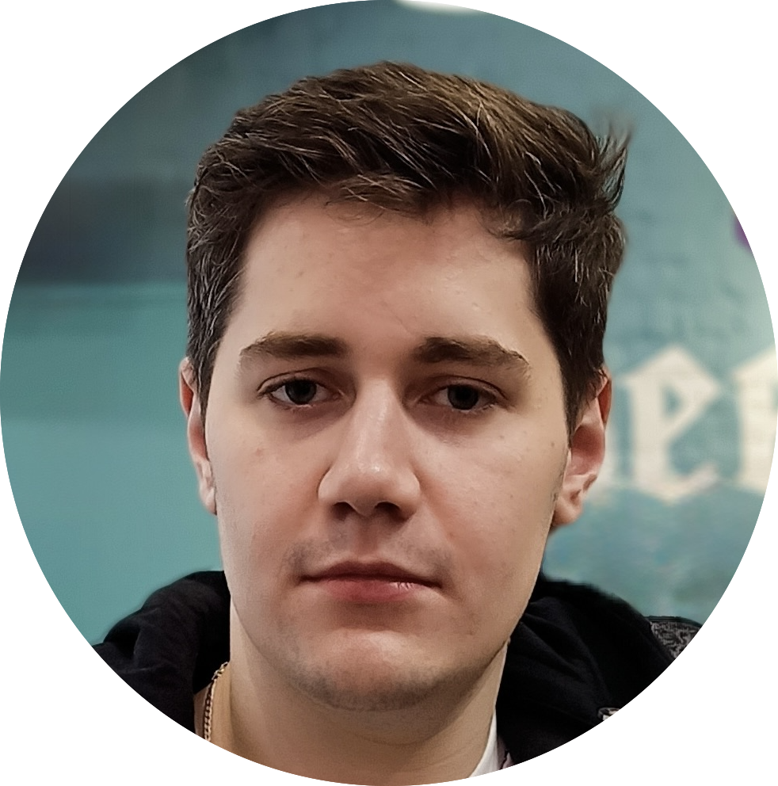

    

<h1 align="center">💫 About Me</h1>

## Hi there! 👋 I'm Roman Sadov Frontend Engineer 👨‍💻

## About

- 🚀 &nbsp;Creating projects of any complexity from scratch
- 💡 &nbsp;Bringing UI/UX ideas to life
- 💼 &nbsp;3 years of experience

  
🔽 &nbsp;<strong>More</strong>

- 🐥 &nbsp;Secretly a duck debugger
- 👔 &nbsp;Organized & standalone
- 🤓 &nbsp;Love to code
- 🌱 &nbsp;Constantly learning
- 📐 &nbsp;Prone to perfectionism
- 🎓 &nbsp;Higher educations
- ☕️ &nbsp;Coffee lover
- 🦄 &nbsp;Believes in unicorns (and clean code)

## Skills

- 👾 &nbsp;Crafting applications, multi-page sites & landing pages
- ✅ &nbsp;Creating reliable & well-functioning interfaces
- 🏎 &nbsp;Writing modern & productive code
- 🎨 &nbsp;Creating semantic, cross-browser & pixel-perfect markup
- 💡 &nbsp;Always exploring new tools & technologies

## Contact

Have a **suggestion** for me? Send a mail to romanwebdev.it@gmail.com or use links below:

[][linkedin]
[][telegram]

## GitHub Analytics

    
    

---

[linkedin]: https://www.linkedin.com/in/romanwebdev-it/
[telegram]: https://t.me/romanwebdev_it
